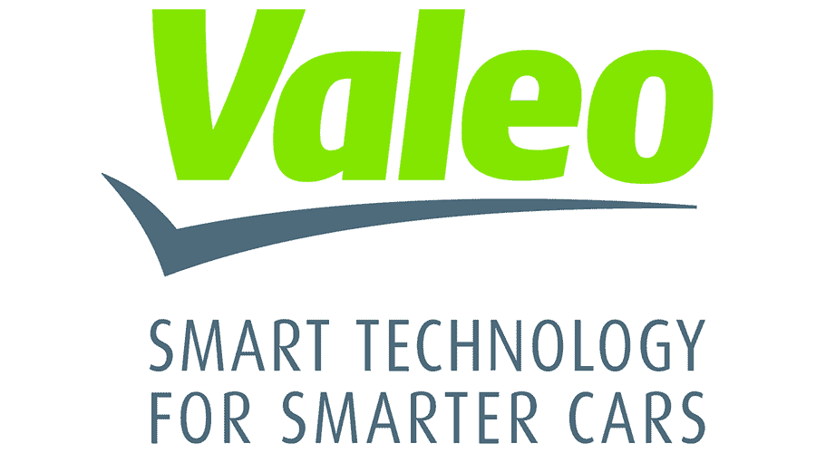

<!-- ------------------------------ -->
{:width="60" height="30" style="vertical-align: top;"} **Senior Machine Learning Engineer at Valeo**

* From Dec. 2018 to Sep.2022.
* I am developing new machine learning algorithms that are related to automotive industry.
* Publishing our work, research activities at top-tier machine learning conferences i.e. WACV, NeurIPS workshop, ICML workshop.
* Innovate and Implement state-of-the-art machine learning techniques.

<!-- ------------------------------ -->

<!-- ------------------------------ -->
{:width="60" height="30" style="vertical-align: top;"} **Embedded System Trainee at Valeo**

* From 2016 to 2017.
* AUTOSAR Platform team member in GEEDS department for 7 months. 

<!-- ------------------------------ -->

