<!-- ------------------------------ -->

    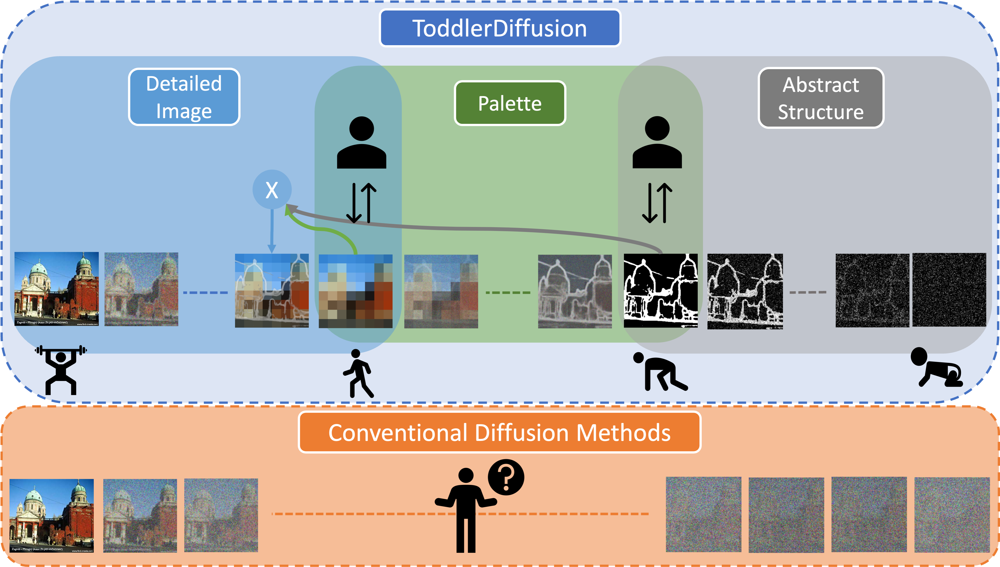

### ToddlerDiffusion: Flash Interpretable Controllable Diffusion Model

**E Mohamed**, L Zhao, Tao Hu, M Cord, P Perez, M Elhouseiny.

<i>Under Review</i>.

<!-- White space clearing element -->

<!-- This is a comment in Markdown -->

<!-- ------------------------------ -->

<!-- ------------------------------ -->

    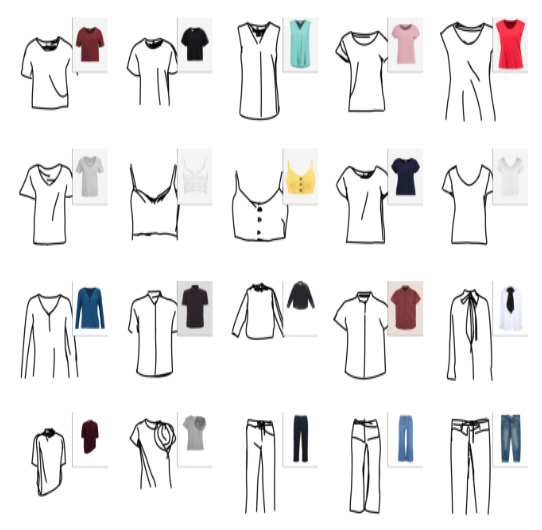

### Sketch2Stitch: GANs for Abstract Sketch-Based Dress Synthesis 

F Khan, D Morelli, **E Mohamed**, M Cornia, R Cucchiara, M Elhoseiny

<i>Under Review</i>.

<!-- White space clearing element -->

<!-- This is a comment in Markdown -->

<!-- ------------------------------ -->

<!-- ------------------------------ -->

    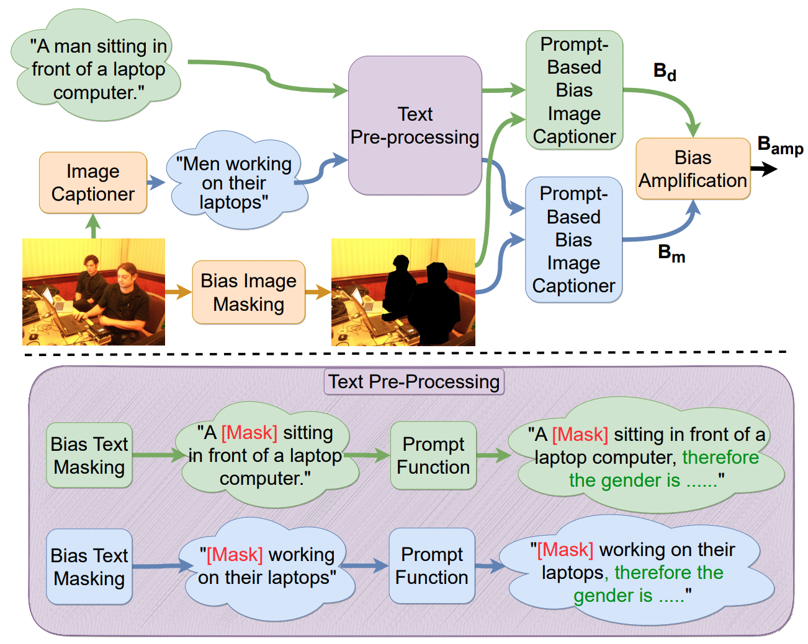

### ImageCaptioner$^2$: Image Captioner for Image Captioning Bias Amplification Assessment 

**E Mohamed**, P Sun, Li Erran Li, M Elhoseiny

<i>Under Review</i>.

<!-- White space clearing element -->

<!-- This is a comment in Markdown -->

<!-- ------------------------------ -->

<!-- ------------------------------ -->

    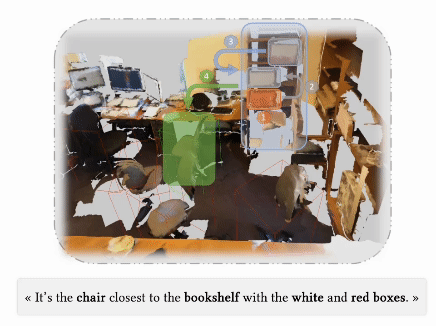

### CoT3DRef: Chain‐of‐Thoughts Data‐Efficient 3D Visual Grounding

 
 

**E Mohamed**, M Ayman, M Ahmed, H Slim, M Elhouseiny.

<i>ICLR 2024</i>.

<!-- White space clearing element -->

<!-- This is a comment in Markdown -->

<!-- ------------------------------ -->

<!-- ------------------------------ -->

    

### HRS-Bench: Holistic, Reliable and Scalable Benchmark for Text-to-Image Models

 
 

**E Mohamed**, P Sun, X Shen, F Khan, L Erran, M Elhoseiny.

<i>ICCV 2023</i>.

<!-- White space clearing element -->

<!-- This is a comment in Markdown -->

<!-- ------------------------------ -->

<!-- ------------------------------ -->

    

### Look Around and Refer: 2D Synthetic Semantics Knowledge Distillation for 3D Visual Grounding

 
 

**E Mohamed**, Y Alsaedy, M Elhouseiny.

<i>NeurIPS 2022</i>.

<!-- White space clearing element -->

<!-- ------------------------------ -->

<!-- ------------------------------ -->

    

### MTL-TransMODS: Cascaded Multi-Task Learning for Moving Object Detection and Segmentation with Unified Transformers
 

E Mohamed, A El-sallab.

<i>NeurIPS workshop 2021</i>.

<!-- White space clearing element -->

<!-- ------------------------------ -->

<!-- ------------------------------ -->

    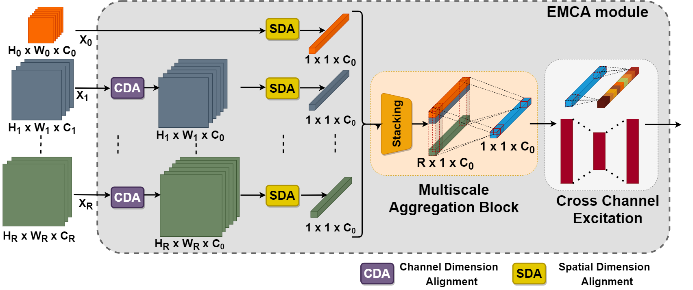

### EMCA: Efficient Multiscale Channel Attention Module

E Mohamed, A El-sallab, M Rashwan.

<i>IEEE Access 2022</i>.

<!-- White space clearing element -->

<!-- ------------------------------ -->

<!-- ------------------------------ -->

    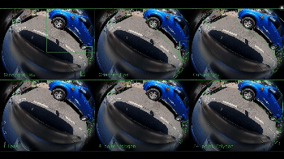

### Generalized Object Detection on Fisheye Cameras for Autonomous Driving: Dataset, Representations and Baseline
 

H Rashed, E Mohamed, G Sistu, VR Kumar, C Eising, A El-Sallab, S Yogamani.  

<i>WACV 2020</i>.

<!-- White space clearing element -->

<!-- ------------------------------ -->

<!-- ------------------------------ -->

    

### INSTA-YOLO: Real Time Instance Segmentation based on YOLO
 

E Mohamed, A Shaker, A El-Sallab, M Hadhoud.

<i>ICML workshop 2020</i>.

<!-- White space clearing element -->

<!-- ------------------------------ -->

<!-- ------------------------------ -->

    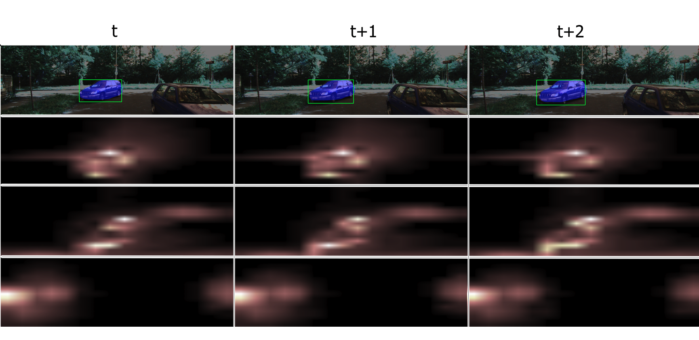

### Spatio-Temporal Multi-Task Learning Transformer for Joint Moving Object Detection and Segmentation
 

E Mohamed, A El-sallab. 

<i>IEEE ITSC 2021</i>.

<!-- White space clearing element -->

<!-- ------------------------------ -->

<!-- ------------------------------ -->

    

### Monocular Instance Motion Segmentation for Autonomous Driving: KITTI InstanceMotSeg Dataset and Multi-task Baseline
  

E Mohamed, M Ewaisha, M Siam, H Rashed, S Yogamani, W Hamdy, M El-Dakdouky, A El-Sallab.

<i>IEEE IV 2021</i>.

<!-- White space clearing element -->

<!-- ------------------------------ -->

<!-- ------------------------------ -->

    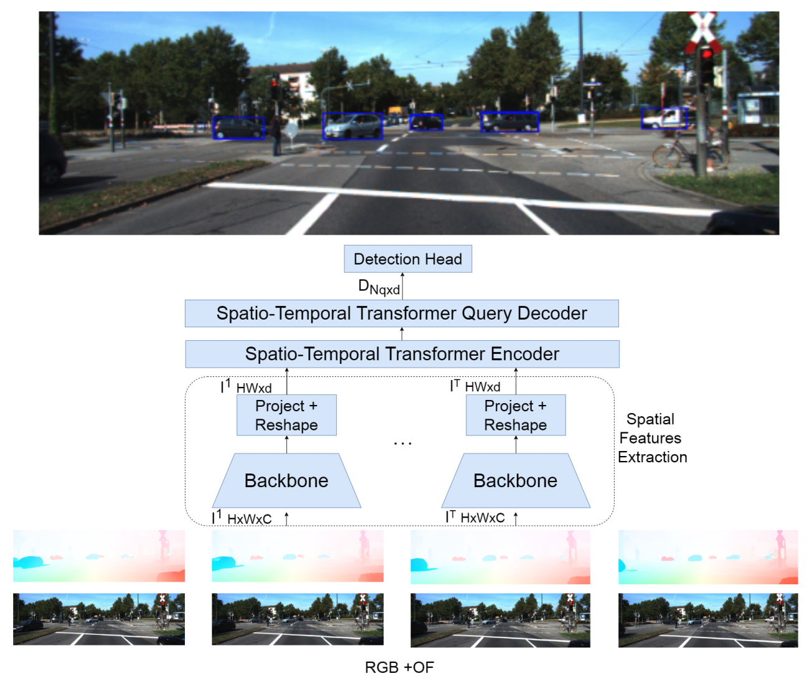

### ST-DETR: Spatio-Temporal Object Traces Attention Detection Transformer
 
 

E Mohamed, A El-sallab.  

<i>ICML workshop 2021</i>.

<!-- White space clearing element -->

<!-- ------------------------------ -->

<!-- ------------------------------ -->

    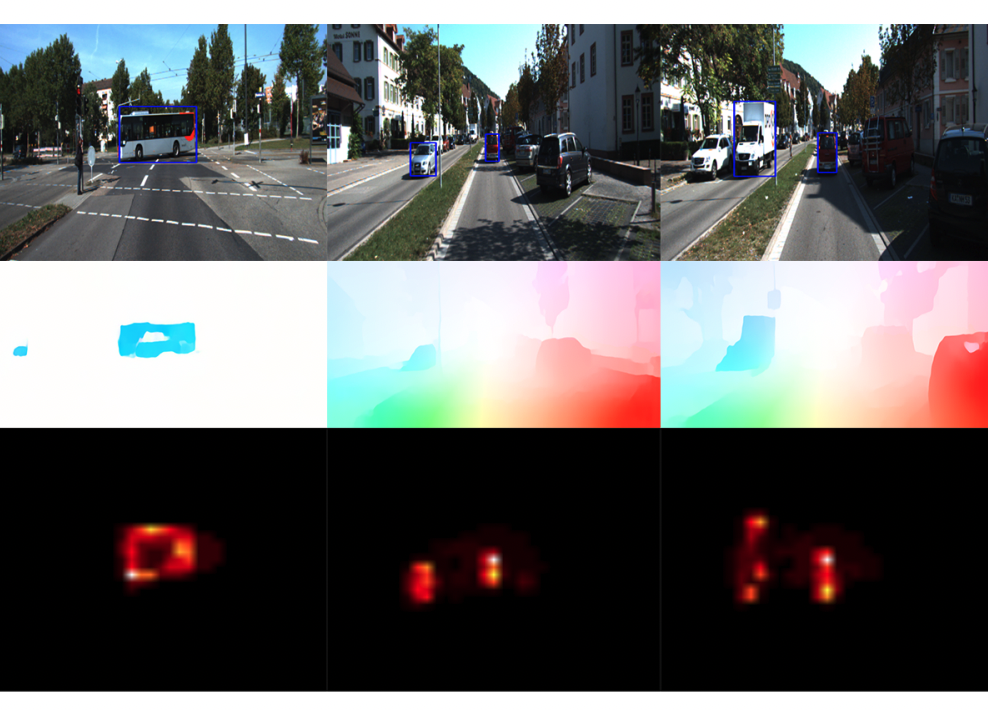

### MODETR: Moving Object Detection with Transformers
 

E Mohamed, A El-sallab.  

<i>NeurIPS workshop 2020</i>. 

<!-- White space clearing element -->

<!-- ------------------------------ -->

<!-- ------------------------------ -->

    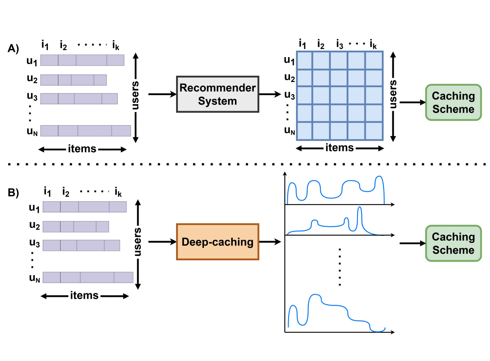

### End-to-End Deep Learning Proactive Content Caching Framework
 
 

E Mohamed, H Ben-Ammar, H M Eraqi, S G Aly, T Elbatt, Y Ghamri-Doudane.
  
<i>Globecom 2022</i>. 

<!-- White space clearing element -->

<!-- ------------------------------ -->

<!-- ------------------------------ -->

    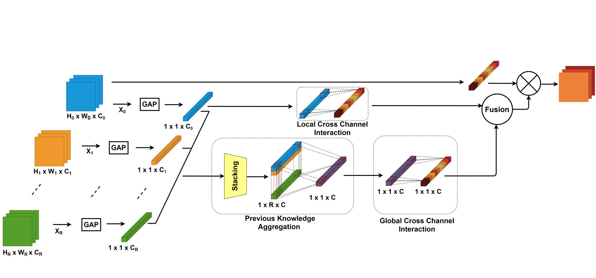

### PKCAM: Previous Knowledge Channel Attention Module 
 
 

E Mohamed, A El-sallab, M Rashwan.  

<i>NeurIPS workshop 2021</i>.

<!-- White space clearing element -->

<!-- ------------------------------ -->

<!-- ------------------------------ -->

    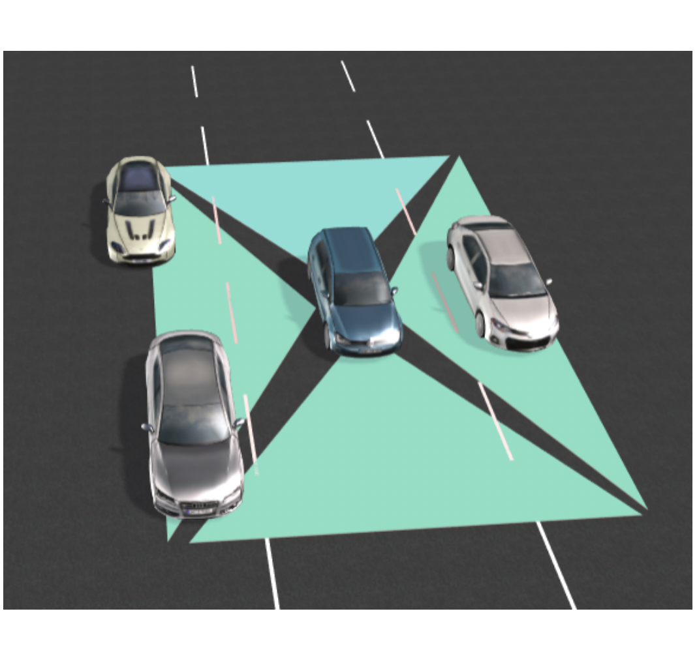

### End-to-End Deep Path Planning and Automatic Emergency Braking Camera Cocoon-based Solution 

E Mohamed, M Abdou, OA Nasr.  

<i>NeurIPS workshop 2019</i>.

<!-- White space clearing element -->

<!-- ------------------------------ --> 
